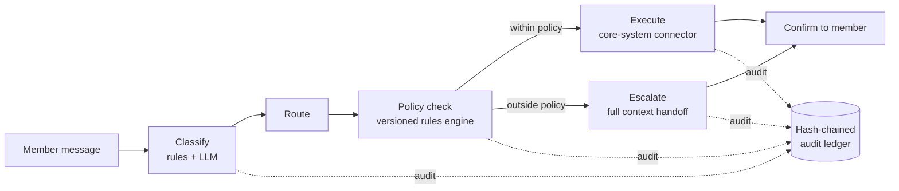

# 🔗 Ledger — An End-to-End Card Servicing Agent

*Conversational resolution for fee reversals, credit-limit increases, and card replacements — with a verifiable, hash-chained audit trail on every decision, and a full-context handoff when a human is needed.*

**Prepared by Paulami Bhosle · CodeStreet 2026**

<!--
  TODO: Replace the badge URLs below with your real ones once you confirm them.
  - The CI badge only works if you have a workflow file in .github/workflows/
    Format: https://github.com/<user>/<repo>/actions/workflows/<workflow-file>.yml/badge.svg
  - Swap "your-demo-link" for your actual deployed demo URL.
-->
[](https://github.com/code-paul-creator/servicing-agent/actions)
[](https://servicing-agent.onrender.com)
[](#architecture)
[](#the-audit-trail)
[](LICENSE)

---

## Table of contents

- [What this is](#what-this-is)
- [Demo](#demo)
- [Architecture](#architecture)
- [The audit trail](#the-audit-trail)
- [Getting started](#getting-started)
- [Running tests](#running-tests)
- [Project structure](#project-structure)
- [What's mocked vs. real](#whats-mocked-vs-real)
- [Roadmap](#roadmap)
- [Team](#team)

---

## What this is

Card issuers get the same three requests constantly — *"waive this fee," "raise my limit," "I lost my card."* Ledger resolves all three end-to-end inside a single conversation: it classifies intent, checks the request against versioned eligibility rules, executes the change, and confirms it — or, when a request falls outside policy, escalates to a human agent with full context so the member never has to repeat themselves.

Every decision along the way — classification, policy check, system call — is written to an **append-only, hash-chained audit ledger** *before* the corresponding action runs. The ledger isn't a log you have to trust; it's independently re-verifiable, and the live demo lets you prove that to yourself.

## Demo

> 🖥️ **[Try the live demo →](https://code-paul-creator.github.io/servicing-agent/)**


*The ledger from genesis — `SESSION STARTED` chains from hash `00000000`, followed by `CONNECTION CONFIGURED` and the member's raw `MESSAGE`, each entry embedding the previous entry's hash.*


*A resolved fee reversal — `POLICY DECISION` ("Within auto-approval policy") followed by the `TOOL CALL` to `core_system:reverse_fee`, then a one-click **Verify chain integrity** confirming all entries are intact.*

<!--
  TODO: still worth adding — a screenshot of Simulate tamper catching a broken hash,
  to complete the "prove it, don't just claim it" trio. Everything else above is real.
-->

**Quick tour (under a minute):**
1. Open the live demo — a session starts and connects to the backend automatically (the ledger shows this from genesis).
2. Try a quick prompt — **Fee reversal**, **Limit increase**, **Lost card**, or **Escalation case**.
3. Watch the ledger fill in on the right as each decision happens, in real time — `MESSAGE` → `POLICY DECISION` → `TOOL CALL` — each hash-chained to the one before it, *before* the corresponding action executes.
4. Click **Verify chain integrity** → **Simulate tamper** → verify again, and watch it get caught.

### Console features

- **Account panel** — live credit limit, available balance, card last-4, and a per-policy usage counter (e.g. `FEE REVERSALS USED 1 / 1`) that updates as the policy engine enforces limits.
- **Reload config.yml** — reloads policy rules without restarting the session, useful for demonstrating versioned policy changes live.
- Backend runs at `servicing-agent.onrender.com`; the console notes the LLM API key lives server-side only and is never exposed to the page.

## Architecture



The model never holds authority to move money or change an account — it *proposes* an action. A separate, versioned policy engine approves or declines it. Only then does a core-system connector execute it. This separation is the core safety property of the system: an LLM classification error can misroute a request, but it can never directly authorize one.

**Stack:** FastAPI + LangGraph state machine · policy engine (versioned YAML rules) · mock core-system connectors · unit-tested audit log.

## The audit trail

Each ledger entry embeds the hash of the entry before it, chaining from a genesis entry (`prev 00000000`) — the same tamper-evidence principle a blockchain relies on, applied to a single authoritative log instead of a distributed one, which is what a servicing audit trail actually needs.

A session's chain looks like: `SESSION STARTED` → `CONNECTION CONFIGURED` → `MESSAGE` (raw member text) → `POLICY DECISION` (e.g. *"Within auto-approval policy"*) → `TOOL CALL` (the actual core-system action and its result) — every entry displayed with its own `prev <hash> → hash <hash>`.

Alter any entry — even one written months earlier — and every hash after it breaks. That's caught by re-verification, not by trusting that nobody touched the table. This is exactly what the **Verify chain integrity → Simulate tamper → verify again** flow in the demo demonstrates live.

## Getting started

```bash
# clone
git clone https://github.com/code-paul-creator/servicing-agent.git
cd servicing-agent/backend

# install
pip install -r requirements.txt

# configure
cp .env.example .env   # add your LLM API key, etc.

# run
uvicorn main:app --reload
```

<!-- TODO: confirm the actual entrypoint file/module name (main:app is a guess) and
     whether config.yml at the repo root needs to be copied/edited too. -->

Then open `servicing-agent-demo.html` in a browser, or navigate to `http://localhost:8000` if the backend serves the frontend directly.

## Running tests

<!--
  TODO: replace with your actual test command once confirmed — this is a placeholder.
  If you have a .github/workflows/tests.yml, mirror the same command here so the
  README and CI never drift apart.
-->
```bash
cd backend
pytest -v
```

Unit tests cover the audit log's hash-chain integrity (including the tamper-detection path), the policy engine's rule evaluation, and the classify → route → execute/escalate state machine transitions.

## Project structure

```
servicing-agent/
├── .github/workflows/     # CI: lint + test on every push
├── backend/
│   ├── main.py             # FastAPI app entrypoint
│   ├── graph/               # LangGraph state machine (classify → policy → execute/escalate)
│   ├── policy/               # Versioned eligibility rules engine
│   ├── ledger/                 # Hash-chained audit log + verification
│   ├── connectors/               # Mock core-system connectors
│   └── tests/                      # Unit tests
├── config.yml               # Policy / environment configuration
├── servicing-agent-demo.html  # Live demo UI
└── LICENSE
```

<!-- TODO: adjust this tree to match what's actually inside backend/ — this is
     a best-guess based on the architecture described in the write-up. -->

## What's mocked vs. real

Being upfront about this heads off judge questions during Q&A:

| Component | Status |
|---|---|
| Intent classification | Real (rules + LLM) |
| Policy engine | Real, versioned rules |
| Hash-chained audit ledger | Real, independently verifiable |
| Core banking system calls | **Mocked** — simulates a card issuer's core system API |
| Human agent handoff | Simulated escalation payload with full context |

## Roadmap

- [ ] Real core-system connector (sandbox API) instead of mocks
- [ ] Multi-turn context retention across sessions
- [ ] Configurable policy versioning UI for compliance teams
- [ ] Structured eval suite for classification accuracy

## Team

**Paulami Bhosle** — [GitHub](https://github.com/code-paul-creator)

Full write-up: [`project_description.pdf`](project_description.pdf) — problem, architecture, classification algorithm, policy rules, evaluation plan
Slides: [`presentation.pptx`](presentation.pptx)

---

*Built for CodeStreet 2026.*
